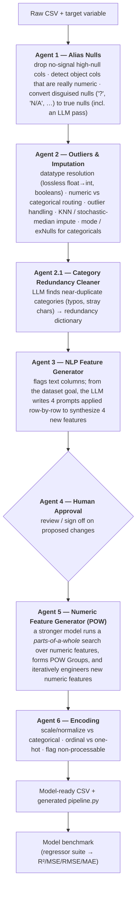

# AMALEE — the Agentic Machine Learning Engineer

> A multi-agent system that turns a **raw CSV + a target variable** into a
> **model-ready dataset and a reusable preprocessing pipeline** — automating the
> unglamorous parts of ML engineering (null handling, outliers, imputation,
> feature engineering, encoding) with a team of specialized LLM agents and
> human-in-the-loop checkpoints.

_Capstone project by **Jesse Anders & Nick Minnard** (Ferris State University AI program). Built on LangGraph + LangChain. Research prototype — see [Status & limitations](#status--limitations)._

---

## What it does

Point AMALEE at a dataset and tell it what you're trying to predict. A sequence
of six specialized agents inspects the data column-by-column and decides how to
clean, transform, and engineer it — the way a data scientist would, but
automated and auditable. Each agent reasons with an LLM but acts through a
**library of deterministic, tested functions** (it decides *what* to do; the
functions do it), and pauses for **human approval** on the judgment calls.

The run produces:
- a cleaned, encoded, **model-ready CSV** (`data_outputs/output.csv`),
- a **generated, re-runnable pipeline** (`runtime_lib/pipeline.py`) capturing every transformation, and
- a **model benchmark** — a suite of regressors trained on the result with R²/MSE/RMSE/MAE reported.

## Architecture

Six agents run as a pipeline; each is a [LangGraph](https://github.com/langchain-ai/langgraph) state machine driven by a per-agent **instruction archive** and backed by a **static function library**.



The detailed original diagram is in [`presentation/Miro Flowchart.pdf`](presentation/Miro%20Flowchart.pdf); the full walkthrough is in [`presentation/AMALEE Presentation.pdf`](presentation/AMALEE%20Presentation.pdf).

### How an agent is built

Each agent separates **judgment** from **execution** — the pattern that makes the system auditable and testable:

- **Instruction archive** (`agent_instructions/agentN_inst.py`) — a set of state-keyed prompts. The agent moves between named states (`AGENT2_START`, `NUMERIC_INST`, `OBJECT_INST_3`, …) rather than free-forming, so its decision path is legible.
- **Static function library** (`runtime_lib/static_agent_libs/agentN_static_lib.py`) — the deterministic pandas operations. The LLM invokes them through an `exec_stored_func` tool; it chooses actions, the library performs them.
- **Persisted state as JSON** (`json_lib/`) — decisions are written to disk (`alias_nulls_list.json`, `saved_encode_dictionary.json`, `saved_redundancy_dictionary.json`, `dataset_goals.json`, `nlp_fe_generated_prompts.json`, …), giving a permanent, reviewable record of what changed and why.
- **Dynamic code generation** — transformations are emitted into a standalone `runtime_lib/pipeline.py`, so the preprocessing AMALEE "figured out" can be re-run on new data without the agents.

### Key engineering ideas

- **Agents decide, functions act.** LLMs never mutate the dataframe directly — they call vetted library functions. Fewer hallucinated transforms, reproducible results.
- **Human-in-the-loop by design.** High-cardinality categoricals and other ambiguous calls are batched for human validation (`--request_human`), not silently guessed.
- **Parts-of-a-whole (POW) feature engineering.** Agent 5 looks for numeric columns that are components of a shared whole and engineers ratio/share features from them — the piece that gave a measurable model lift (below).
- **Multi-LLM / local-friendly.** Runs against OpenAI (`gpt-4o`) or a **local model via LM Studio** (Llama-3-8B), selectable at the CLI — no vendor lock-in, and it can run fully offline.
- **Composable.** Every agent can be toggled on/off independently, so you can run the whole pipeline or just one stage.

## Results (auto-mpg regression)

AMALEE was evaluated against a **human-built baseline** — the same `auto-mpg` dataset preprocessed by hand for a course assignment (ARTI 350). Test R² of the best models:

| Pipeline | Gradient Boosting | Extra-Trees | Random Forest |
|---|---|---|---|
| Manual baseline (hand-built) | 0.8758 | 0.8804 | 0.8808 |
| **AMALEE** — automated, no POW features | 0.8875 | 0.8805 | 0.8804 |
| **AMALEE** — automated, **with POW features** | **0.8956** | 0.8873 | 0.8816 |

Two takeaways: AMALEE's **fully automated** preprocessing **matched or beat** the hand-built pipeline, and its generated **POW features added a further lift** (Gradient Boosting Test R² 0.8758 → 0.8956). Full metric tables (MSE/RMSE/MAE/Adj-R²/overfit) are in the presentation.

## Running it

```bash
pip install -r requirements.txt
```

AMALEE uses OpenAI by default, so set your key (see `.envSAMPLE`):

```bash
export OPENAI_API_KEY="sk-..."   # or place it in a .env file
```

Run on the bundled auto-mpg dataset (defaults shown):

```bash
python main.py --data_input_path=data_inputs/data-arti-300/auto-mpg.csv --target_var=mpg
```

Run against a **local** model instead of OpenAI (via [LM Studio](https://lmstudio.ai/)):

```bash
python main.py --llm_platform=lm-studio --data_input_path=data_inputs/titanic_passenger_list.csv --target_var=Survived
```

Agents are toggled individually — enable the stages you want:

```bash
python main.py --data_input_path=... --target_var=... \
  --run_agent_1=True --run_agent_2=True --run_agent_2_1=True \
  --run_agent_3=True --run_agent_5=True --run_agent_6=True \
  --request_human=True --pow_iter=2
```

Useful flags: `--llm_platform` (`openai` | `lm-studio`), `--openai_model`, `--lms_model`, `--super_gpt_model` (Agent 5), `--target_var`, `--id_var`, `--pow_iter`, `--max_nlp_token_features`, `--request_human`, `--run_agent_1…6`, and the `runtime_lib` output paths.

## Repository layout

```
Agentic-ML-Engineer/
  main.py                      orchestrator: CLI, agent sequencing, model benchmark
  agent_builds/base_agents.py  the LangGraph agent scaffold (StateGraph + ChatOpenAI)
  agent_instructions/          per-agent instruction archives (agent1…agent6)
  runtime_lib/
    static_agent_libs/         each agent's deterministic function library
    pipeline.py                generated, re-runnable preprocessing pipeline
    static_lib.py · sandbox.py shared helpers + code-exec sandbox
  json_lib/                    persisted decisions/state (nulls, encodings, redundancy, goals)
  data_inputs/ · data_outputs/ sample datasets in, model-ready data out
  saved_generations/           archived end-to-end runs
  utils.py
  presentation/                AMALEE Presentation.pdf · Miro Flowchart.pdf
```

## Tech stack

Python · LangGraph · LangChain (`langchain_openai`) · OpenAI (`gpt-4o`) / LM Studio (local Llama-3) · pandas · scikit-learn · scipy · word2number.

## Status & limitations

A working capstone **research prototype**, not a production tool. Known rough edges (from the project to-do list):

- No per-agent checkpoint save/resume yet — the highest-priority next step is the option to write out and pick up the dataset at each agent boundary.
- An encode-dictionary save can fail on NumPy `int64` keys (JSON requires native types).
- A pandas chained-assignment `FutureWarning` in the categorical mode-impute path.
- Ideas not yet built: a dedicated BERT/autoencoder agent for redundancy detection, and tighter integration of the dataset goal into the POW agent.

## Credits

Built by **Jesse Anders** and **Nick Minnard** as a capstone for the Ferris State University AI program. See `capstone_journals/` for the development logs.
